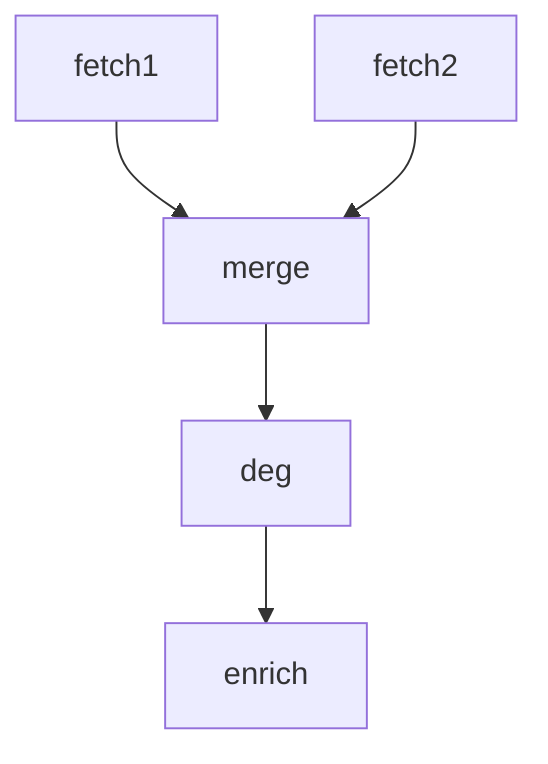

# Protocol: 4-Node Breast Cancer DEG Pipeline

**Planner Agent:** manual-test | **Confidence:** high | **Decision:** proceed

---

## research_question

Compare estrogen receptor positive (ER+) vs estrogen receptor negative (ER-) breast cancer
tumors to identify differentially expressed genes. ER status is the most established molecular
classifier in breast cancer — ER+ and ER- tumors have distinct transcriptional programs,
prognosis, and treatment responses. Grouping by `er_status` column (P = positive, N = negative).

**Group column:** `er_status`
**Group labels:** `P` (ER-positive) vs `N` (ER-negative)
**Datasets:** GSE25066 + GSE20194 (breast cancer, GPL96 platform)

**Per-dataset group columns:**
| Dataset | Group column | Values | Notes |
|---------|-------------|--------|-------|
| GSE25066 | `er_status_ihc` | P, N | ER status by immunohistochemistry |
| GSE20194 | `er_status` | P, N | ER status |

Both columns represent the same biology. Each fetch extracts its dataset's column into a standardized `sample_group.csv` for downstream.

---

## config

```yaml
fetch1:
  subcommand: fetch
  gse_id: GSE25066
  rename: er_status_ihc:group

fetch2:
  subcommand: fetch
  gse_id: GSE20194
  rename: er_status:group

merge:
  subcommand: intersect
  batch_correction: true

deg:
  subcommand: run
  method: limma
  logfc_cutoff: 0.5

enrich:
  subcommand: enrich
  tax-id: "9606"
```

---

## 5. analysis_pipeline

### Workflow Diagram



### Detailed Steps

| Step | Method | Tool/R Package | Input | Output | Quality Gate | Fallback |
|------|--------|----------------|-------|--------|--------------|----------|
| fetch1 | GEO data retrieval | geo-microarray-processing | — | probe + gene expression + metadata | — | — |
| fetch2 | GEO data retrieval | geo-microarray-processing | — | probe + gene expression + metadata | — | — |
| merge | Gene intersection + ComBat | batch-correction | gene expression matrices | shared expression + metadata + PCA plots | — | — |
| deg | Differential expression (ER+ vs ER-) | differential-analysis | merged expression, sample metadata | DEGs, volcano, heatmap | — | — |
| enrich | GO/KEGG enrichment of DEGs | go-kegg-enrichment | DEG gene list | enrichment tables, bar/bubble plots | — | — |

---

## 9. quality_gates_and_veto_rules

(no gates — first multi-node test)

---
